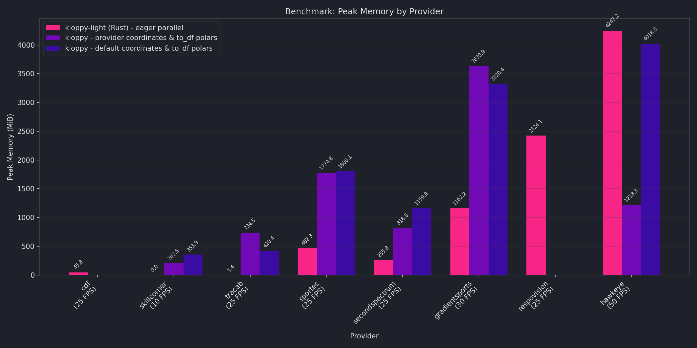
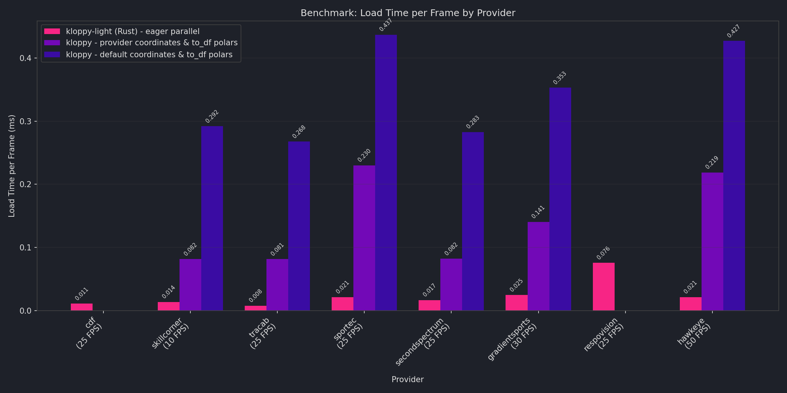

# Benchmarks

Performance comparison between **fast-forward** (Rust core) and **kloppy** (pure Python) across all supported providers.

## Load Time

Total wall-clock time to load tracking data into a wide-layout Polars DataFrame.

## Peak Memory

Maximum memory usage during the load process.

!!! note "HawkEye"
    HawkEye benchmarks use `parallel=True`, which loads multiple files in parallel. Setting `parallel=False` decreases peak memory but increases load time.

## Load Time per Frame

Load time normalized by the number of frames, showing per-frame overhead independent of file size.

## Methodology

- **Layout**: wide (one row per frame, all players as columns)
- **Providers**: sorted by input file size (ascending, left to right)
- **Configurations**:
    - **fast-forward (Rust) - eager parallel**: Rust-based parsing with parallel I/O where applicable
    - **kloppy - provider coordinates & to_df polars**: kloppy loading in provider-native coordinates, converted to Polars
    - **kloppy - default coordinates & to_df polars**: kloppy loading with default coordinate transformation, converted to Polars
- **FPS**: shown per provider on the x-axis (affects frame count for same-duration matches)
