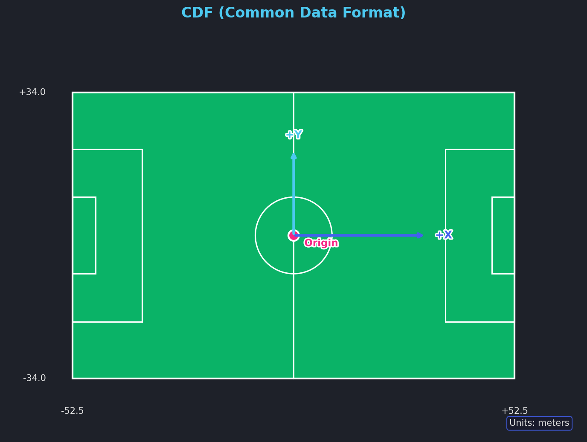
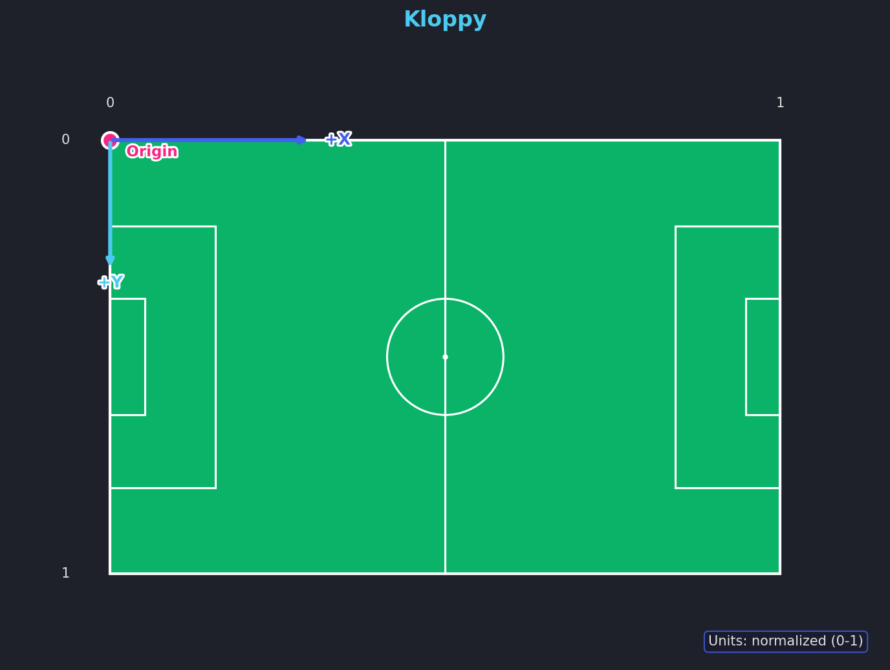
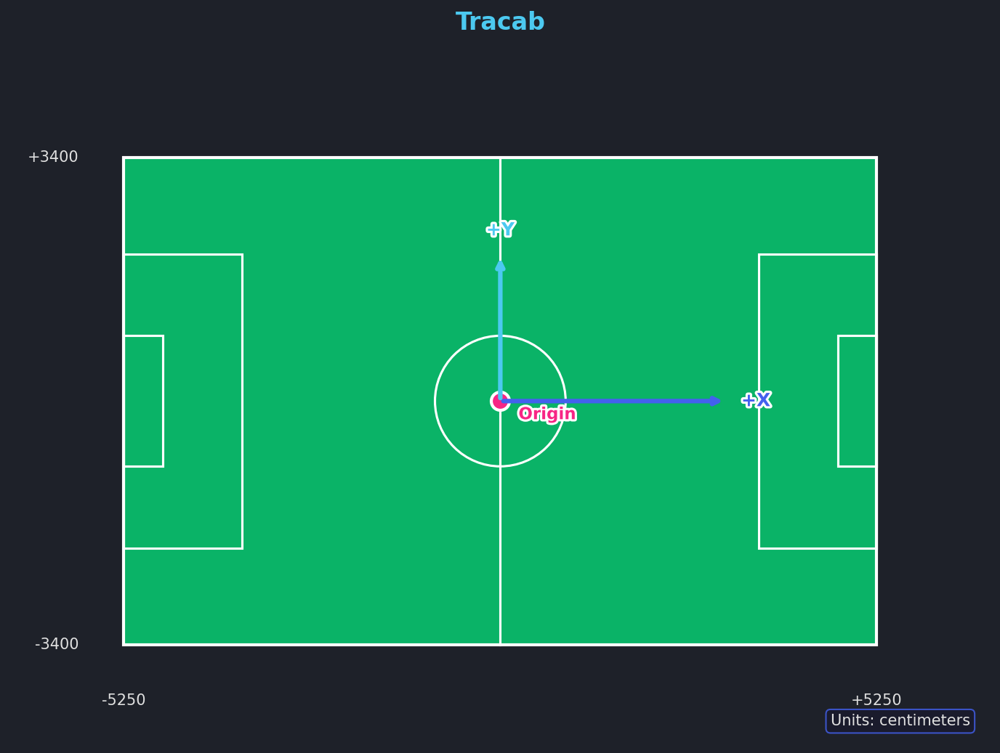
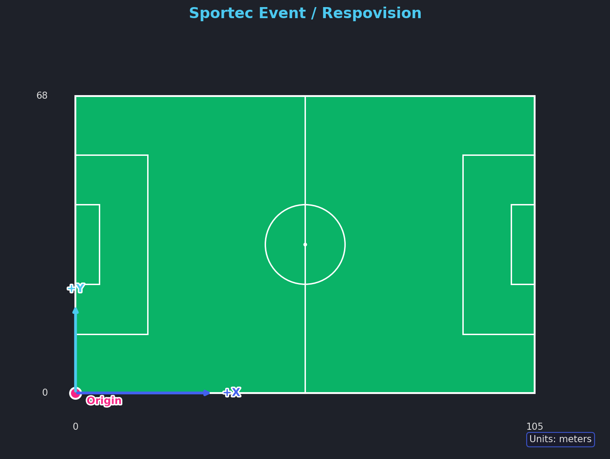
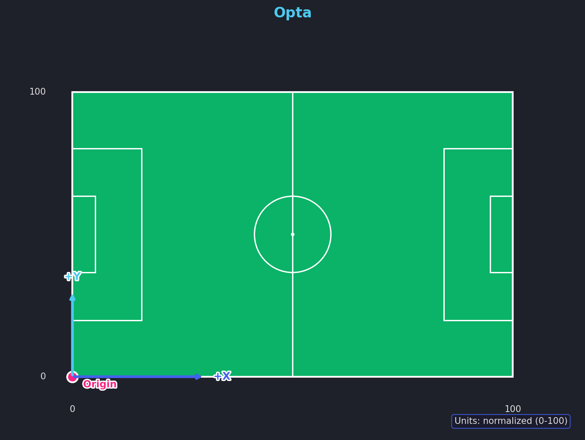

# Coordinate Systems

fast-forward supports 14 named coordinate systems that map to 6 unique coordinate system definitions. Many providers use the same underlying system (CDF), just with different names.

## Alias Table

| Name | Unique System | Origin | Units | Y-axis |
|------|---------------|--------|-------|--------|
| `cdf` | CDF | Center | meters | Up |
| `secondspectrum` | CDF | Center | meters | Up |
| `skillcorner` | CDF | Center | meters | Up |
| `pff` | CDF | Center | meters | Up |
| `gradientsports` | CDF | Center | meters | Up |
| `sportec:tracking` | CDF | Center | meters | Up |
| `hawkeye` | CDF | Center | meters | Up |
| `signality` | CDF | Center | meters | Up |
| `kloppy` | Kloppy | Top-left | 0-1 | Down |
| `tracab` | Tracab | Center | cm | Up |
| `sportvu` | SportVU | Top-left | meters | Down |
| `statsperform` | SportVU | Top-left | meters | Down |
| `sportec:event` | Sportec Event | Bottom-left | meters | Up |
| `respovision` | Sportec Event | Bottom-left | meters | Up |
| `opta` | Opta | Bottom-left | 0-100 | Up |

## Unique Coordinate Systems

### CDF (Common Data Format)

The default and intermediate coordinate system. All transformations pass through CDF.

- **Origin:** Center of the pitch
- **X:** Left to right, `[-pitch_length/2, +pitch_length/2]`
- **Y:** Bottom to top, `[-pitch_width/2, +pitch_width/2]`
- **Units:** Meters



**Aliases:** `cdf`, `secondspectrum`, `skillcorner`, `pff`, `gradientsports`, `sportec:tracking`, `hawkeye`, `signality`

---

### Kloppy

Normalized coordinates used by the [kloppy](https://github.com/PySport/kloppy) library.

- **Origin:** Top-left corner
- **X:** Left to right, `[0, 1]`
- **Y:** Top to bottom (inverted), `[0, 1]`
- **Units:** Normalized (0-1)



---

### Tracab

Native Tracab coordinate system.

- **Origin:** Center of the pitch
- **X:** Left to right, `[-pitch_length/2 * 100, +pitch_length/2 * 100]`
- **Y:** Bottom to top, `[-pitch_width/2 * 100, +pitch_width/2 * 100]`
- **Units:** Centimeters



---

### SportVU / StatsPerform

Used by StatsPerform and SportVU systems.

- **Origin:** Top-left corner
- **X:** Left to right, `[0, pitch_length]`
- **Y:** Top to bottom (inverted), `[0, pitch_width]`
- **Units:** Meters


**Aliases:** `sportvu`, `statsperform`

---

### Sportec Event / Respovision

Used by Sportec event data and Respovision.

- **Origin:** Bottom-left corner
- **X:** Left to right, `[0, pitch_length]`
- **Y:** Bottom to top, `[0, pitch_width]`
- **Units:** Meters



**Aliases:** `sportec:event`, `respovision`

---

### Opta

Opta's normalized coordinate system.

- **Origin:** Bottom-left corner
- **X:** Left to right, `[0, 100]`
- **Y:** Bottom to top, `[0, 100]`
- **Units:** Normalized (0-100)



## Transforming Coordinates

```python
# Load in native coordinates, then transform
dataset = tracab.load_tracking(
    raw_data="tracking.dat",
    meta_data="metadata.xml",
    coordinates="tracab",  # Keep native Tracab (centimeters)
)

# Transform to Opta coordinates
opta_dataset = dataset.transform(to_coordinates="opta")
```

All transformations use CDF as an intermediate: **source -> CDF -> target**. This means you can transform between any two coordinate systems.

See [Transformations](transformations.md) for more details.
