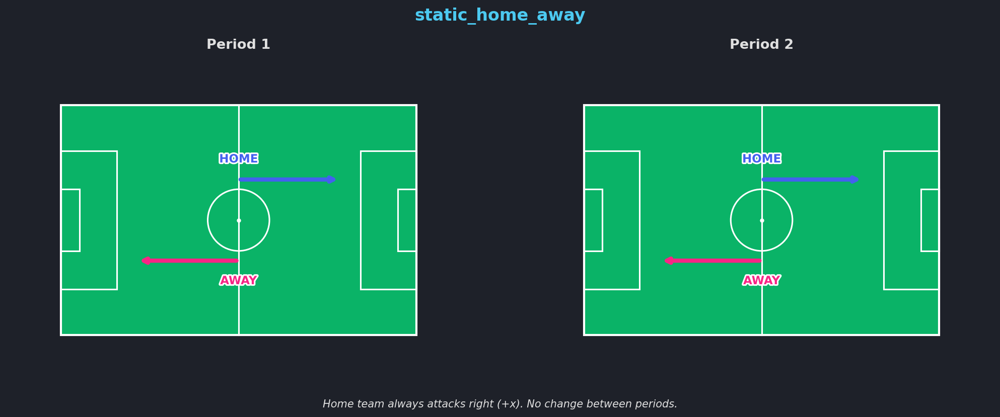
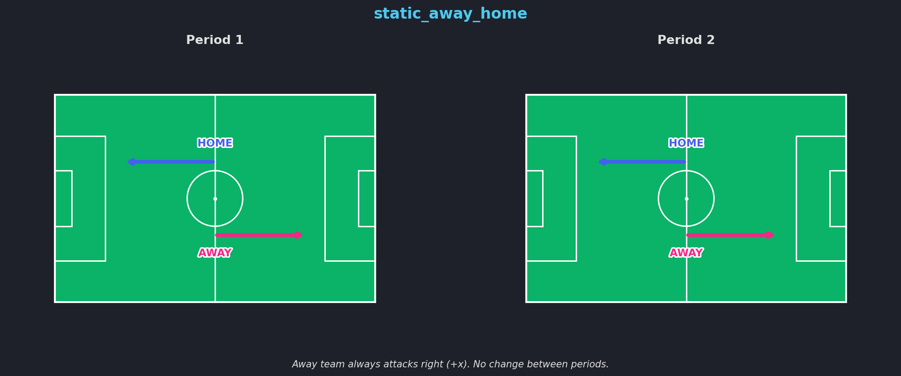
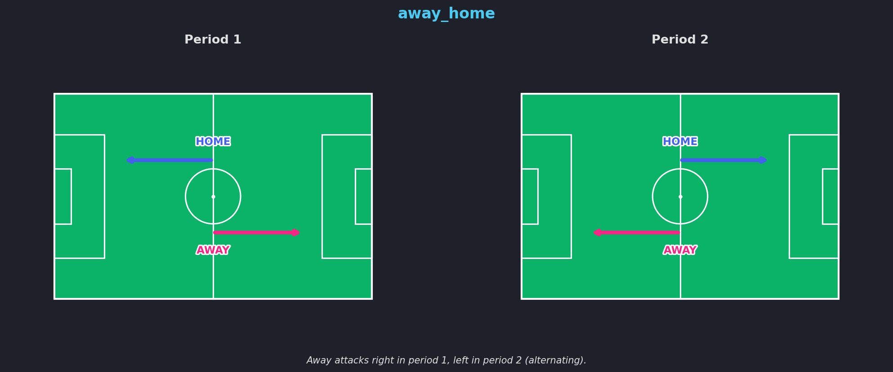
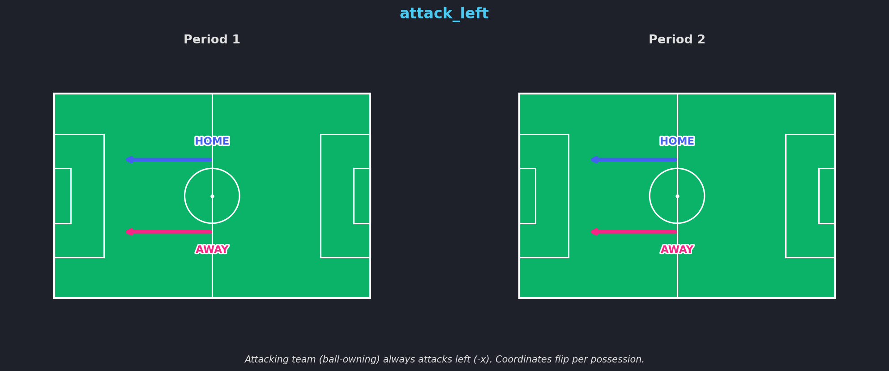

# Orientations

Orientation controls the attacking direction of teams in the coordinate space. In real matches, teams switch sides at halftime. Orientation settings let you normalize this so your analysis doesn't need to handle side-switching manually.

## Overview

| Orientation | Description | Coordinates change between periods? |
|-------------|-------------|--------------------------------------|
| `static_home_away` | Home always attacks right (+x) | No |
| `static_away_home` | Away always attacks right (+x) | No |
| `home_away` | Home attacks right in P1, left in P2 | Yes |
| `away_home` | Away attacks right in P1, left in P2 | Yes |
| `attack_right` | Attacking team always attacks right | Yes (per possession) |
| `attack_left` | Attacking team always attacks left | Yes (per possession) |

## Static Orientations

Static orientations ensure coordinates remain consistent across all periods. No flipping occurs between halves.

### static_home_away (default)

The home team attacks towards positive x (+x, right) for the entire match. This is the default orientation.



### static_away_home

The away team attacks towards positive x (+x, right) for the entire match.



## Alternating Orientations

Alternating orientations reflect the real-world side switch at halftime. Coordinates are flipped between periods.

### home_away

Home team attacks right in the first half, left in the second half (matching real-world side switching).


### away_home

Away team attacks right in the first half, left in the second half.



## Possession-Based Orientations

These orientations normalize by the ball-owning team, flipping coordinates on every change of possession.

### attack_right

The attacking (ball-owning) team always attacks towards positive x (+x, right).


### attack_left

The attacking (ball-owning) team always attacks towards negative x (-x, left).



## How Detection Works

fast-forward automatically detects the attacking direction from the data. It calculates the average x-position of home team players in the first frame of each period:

- If the average is **negative** (left side of pitch), the home team is attacking **right** (left-to-right)
- If the average is **positive** (right side of pitch), the home team is attacking **left** (right-to-left)

This detection happens during parsing and is used to determine whether coordinates need to be flipped to match the requested orientation.

## Transforming Orientation

```python
# Load with default static_home_away
dataset = secondspectrum.load_tracking(
    "tracking.jsonl", "metadata.json",
    orientation="static_home_away",
)

# Transform to alternating orientation
dataset = dataset.transform(to_orientation="home_away")
```

When orientation is flipped, both x and y coordinates are negated (reflected around the center point).
