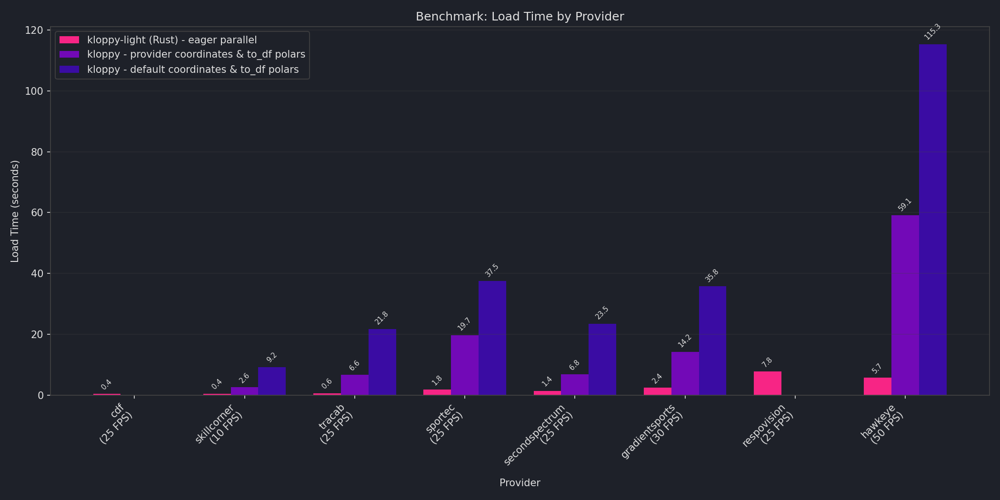

---
hide:
  - title
---
<p align="center">
  
</p>

**Fast, Rust-powered tracking data loader for soccer analytics.**

fast-forward loads tracking data from all major providers into [Polars](https://pola.rs/) DataFrames with a unified API. Built on a Rust core for speed, it handles parsing, coordinate transformations, and orientation normalization out of the box.

``pip install fast-forward``

## Key Features

- **10 providers** supported with a consistent `load_tracking()` interface
- **Polars DataFrame** and **PySpark DataFrame** support for fast, memory-efficient data processing
- **Coordinate transformations** between all major coordinate systems
- **Orientation normalization** to ensure consistent attacking directions
- **3 layouts** (long, long_ball, wide) for different analysis workflows

## Benchmarks

fast-forward's Rust core is significantly faster than pure-Python alternatives. See the full [Benchmarks](benchmarks.md) page for details.



## Quick Example

```python
from fastforward import secondspectrum

dataset = secondspectrum.load_tracking(
    raw_data="tracking.jsonl",
    meta_data="metadata.json",
)

# Access data via properties
dataset.tracking    # Polars DataFrame with tracking data
dataset.metadata    # Match-level metadata (1 row)
dataset.teams       # Team info (2 rows)
dataset.players     # Player roster
dataset.periods     # Period boundaries

# Transform coordinates
transformed = dataset.transform(
    to_coordinates="opta",
    to_orientation="home_away",
)
```

## Supported Providers

| Provider                                   | Format                     | Files Required |
| ------------------------------------------ | -------------------------- | -------------- |
| [CDF](providers/cdf.md)                       | JSONL + JSON               | 2              |
| [GradientSports](providers/gradientsports.md) | JSONL + JSON               | 3              |
| [HawkEye](providers/hawkeye.md)               | Per-minute text + JSON/XML | Multiple       |
| [Respovision](providers/respovision.md)       | JSONL (embedded metadata)  | 1              |
| [SecondSpectrum](providers/secondspectrum.md) | JSONL + JSON               | 2              |
| [Signality](providers/signality.md)           | JSON (per-period)          | 3+             |
| [SkillCorner](providers/skillcorner.md)       | JSONL + JSON               | 2              |
| [Sportec](providers/sportec.md)               | XML                        | 2              |
| [StatsPerform](providers/statsperform.md)     | MA25 text + MA1 JSON/XML   | 2              |
| [Tracab](providers/tracab.md)                 | DAT/JSON + XML/JSON        | 2              |

## Next Steps

- [Getting Started](getting-started.md) - Installation and first steps
- [TrackingDataset](concepts/dataset.md) - Understand the data structure
- [Coordinate Systems](concepts/coordinate-systems.md) - How coordinates work
- [Providers](providers/index.md) - Detailed provider documentation
